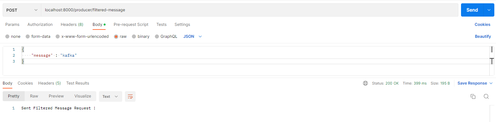
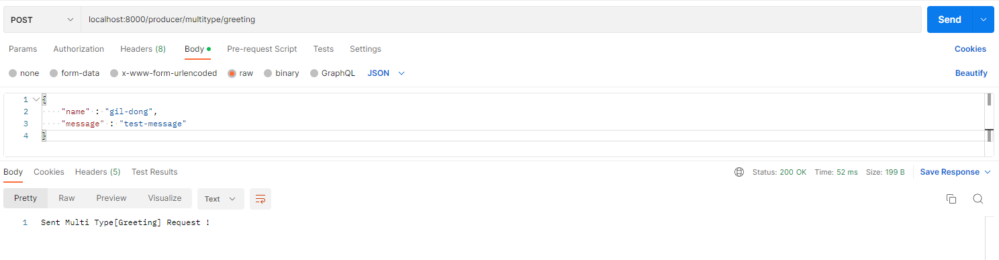

# Spring Kafka Start

Spring Framework 에서 지원하는 Kafka Client API 인 Spring Kafka 입니다.   
<br />

### 목차
- <a href="#topic">토픽 생성</a>
- <a href="#event-publish-consume">이벤트 Publish 및 Consume</a>
    - <a href="#filter">Filter 가 적용된 이벤트</a>
    - <a href="#partition">특정 파티션의 이벤트</a>
    - <a href="#object">객체 타입의 이벤트</a>
    - <a href="multitype">여러 객체 타입의 이벤트</a>

<br />
<br />

Spring Boot 프로젝트 생성 후 dependency 를 추가합니다.   
```groovy
implementation 'org.springframework.kafka:spring-kafka'
testImplementation 'org.springframework.kafka:spring-kafka-test'
``` 
<br />
<br />
<br />
<br />

<div id="topic"></div>

## 토픽 생성
Apache Kafka Admin 도입 후 Spring 애플리케이션에서 토픽을 생성할 수 있습니다.   
`KafkaTopicConfig` 클래스를 다음과 같이 생성합니다.   
```java
@Configuration
public class KafkaTopicConfig {

    @Value(value = "${spring.kafka.bootstrap-servers}")
    private String bootstrapAddress;

    @Value("${topic.message.name}")
    String messageTopicName;

    @Bean
    public KafkaAdmin kafkaAdmin() {
        Map<String, Object> configs = new HashMap<>();
        configs.put(AdminClientConfig.BOOTSTRAP_SERVERS_CONFIG, bootstrapAddress);
        return new KafkaAdmin(configs);
    }

    @Bean
    public NewTopic messageTopic() {
        return new NewTopic(messageTopicName, 1, (short) 1);
    }
}
```
<br />
<br />
<br />
<br />

<div id="event-publish-consume"></div>

## 이벤트 Publish 및 Consume

메시지를 생성하려면 먼저 `ProducerFactory` 를 구성해야 합니다.   
Kafka 토픽에 메시지를 보내기 위해 편리한 메서드를 제공 하는 `KafkaTemplate` 이 필요합니다.   
`KafkaProducerConfig` 클래스를 다음과 같이 생성합니다.   
```java
@Configuration
public class KafkaProducerConfig {

    @Value(value = "${spring.kafka.bootstrap-servers}")
    private String bootstrapAddress;

    @Bean
    public ProducerFactory<String, String> producerFactory() {
        Map<String, Object> configProps = new HashMap<>();
        configProps.put(ProducerConfig.BOOTSTRAP_SERVERS_CONFIG, bootstrapAddress);
        configProps.put(ProducerConfig.KEY_SERIALIZER_CLASS_CONFIG, StringSerializer.class);
        configProps.put(ProducerConfig.VALUE_SERIALIZER_CLASS_CONFIG, StringSerializer.class);
        return new DefaultKafkaProducerFactory<>(configProps);
    }

    @Bean
    public KafkaTemplate<String, String> kafkaTemplate() {
        return new KafkaTemplate<>(producerFactory());
    }
}
```
<br />

이벤트를 Kafka 로 전송하는 송신 API 인 `MessageProducer` 클래스를 작성합니다.   

```java
@Component
public class MessageProducer {
    private KafkaTemplate<String, String> kafkaTemplate;

    @Value("${topic.message.name}")
    String messageTopicName;

    public MessageProducer(KafkaTemplate<String, String> kafkaTemplate, KafkaTemplate<String, Greeting> greetingKafkaTemplate, KafkaTemplate<String, Object> multiTypeKafkaTemplate) {
        this.kafkaTemplate = kafkaTemplate;
    }

    public void sendMessage(String message) {
        CompletableFuture<SendResult<String, String>> future = kafkaTemplate.send(messageTopicName, message);
        future.whenComplete((result, e) -> {
            if (e == null) {
                System.out.println("Sent message=[" + message + "] with offset=[" + result.getRecordMetadata().offset() + "]");
            } else {
                System.out.println("Unable to send message=[" + message + "] due to : " + e.getMessage());
            }
        });
    }
}
```
`KafkaTemplate` 의 `send()` 메서드는 `CompletableFuture` 객체를 반환합니다.   
비동기 방식으로 동작하기 때문에 `CompletableFuture` 의 `whenComplete()` 메서드로   
이벤트를 성공적으로 전송했을 경우와 실패했을 경우 로그를 출력합니다.   
<br />
<br />

이벤트 소비를 위해 `ConsumerFactory` 및 `KafkaListenerContainerFactory` 를 구성해야 합니다.   
빈을 추가하면 `@KafkaListener` 주석을 사용하여 소비자를 구성할 수 있습니다.   

```java
@EnableKafka
@Configuration
public class KafkaConsumerConfig {

    @Value(value = "${spring.kafka.bootstrap-servers}")
    private String bootstrapAddress;

    public ConsumerFactory<String, String> consumerFactory(String groupId) {
        Map<String, Object> props = new HashMap<>();
        props.put(ConsumerConfig.BOOTSTRAP_SERVERS_CONFIG, bootstrapAddress);
        props.put(ConsumerConfig.KEY_DESERIALIZER_CLASS_CONFIG, StringDeserializer.class);
        props.put(ConsumerConfig.VALUE_DESERIALIZER_CLASS_CONFIG, StringDeserializer.class);
        props.put(ConsumerConfig.GROUP_ID_CONFIG, groupId);

        return new DefaultKafkaConsumerFactory<>(props);
    }

    public ConcurrentKafkaListenerContainerFactory<String, String> kafkaListenerContainerFactory(String groupId) {
        ConcurrentKafkaListenerContainerFactory<String, String> factory = new ConcurrentKafkaListenerContainerFactory<>();
        factory.setConsumerFactory(consumerFactory(groupId));
        return factory;
    }

    @Bean
    public ConcurrentKafkaListenerContainerFactory<String, String> messageKafkaListenerContainerFactory() {
        return kafkaListenerContainerFactory("message");
    }
}
```
`@KafkaListener` 주석을 감지하려면 `Configuration` 클래스에 `@EnableKafka` 주석이 필요합니다.   
또한 Group Id 를 지정해 Group 간 서로 다른 리스너를 구성할 수 있습니다.   
<br />
<br />

이벤트를 소비하는 리스너인 `MessageListener` 클래스를 작성합니다.   

```java
@Component
public class MessageListener {

    @KafkaListener(topics = "${topic.message.name}", groupId = "message", containerFactory = "messageKafkaListenerContainerFactory")
    public void listenMessage(String message) {
        System.out.println("Listen Message: " + message);
    }
}
```
<br />
<br />

이벤트를 발행하는 컨트롤러인 `ProducerController` 클래스를 작성합니다.   
```java
@RestController
@RequestMapping("/producer")
public class ProducerController {

    private final MessageProducer messageProducer;

    public ProducerController(MessageProducer messageProducer) {
        this.messageProducer = messageProducer;
    }

    @PostMapping("/message")
    public String message(@RequestBody String message) {
        messageProducer.sendMessage(message);
        return "Sent Message Request !";
    }
}
```
<br />

POSTMAN 을 이용하여 테스트합니다.   
<br>

<div align="center">
  
</div>
<br />
<br />

<div align="center">
  
</div>
<br />
<br />
<br />
<br />

<div id="filter"></div>

## Filter 가 적용된 이벤트

이벤트를 소비할 때, Filter 를 적용하여 특정 키워드가 들어간 이벤트를 제외할 수 있습니다.   
<br />

`filtered-message` 토픽을 생성하기 위해 `KafkaTopicConfig` 클래스에 다음 내용을 추가합니다.   

```java
public class KafkaTopicConfig {
    @Value("${topic.filtered-message.name}")
    String filteredMessageTopicName;

    @Bean
    public NewTopic filteredMessageTopic() {
        return new NewTopic(filteredMessageTopicName, 1, (short) 1);
    }
}
```
<br />
<br />

`filtered-message` 토픽에 이벤트를 전송하기위해 `MessageProducer` 클래스에 다음 내용을 추가합니다.   
```java
public class MessageProducer {
    private KafkaTemplate<String, String> kafkaTemplate;

    @Value("${topic.filtered-message.name}")
    String filteredMessageTopicName;

    public void sendFilteredMessage(String message) {
        kafkaTemplate.send(filteredMessageTopicName, message)
                .whenComplete((result, e) -> {
                    if (e == null) {
                        System.out.println("Sent message=[" + message + "] with offset=[" + result.getRecordMetadata().offset() + "]");
                    } else {
                        System.out.println("Unable to send message=[" + message + "] due to : " + e.getMessage());
                    }
                });
    }
}
```
<br />
<br />

Filter 를 적용할 `ConsumerFactory` 를 추가합니다.   

```java
public class KafkaConsumerConfig {

    @Bean
    public ConcurrentKafkaListenerContainerFactory<String, String> filterKafkaListenerContainerFactory() {
        ConcurrentKafkaListenerContainerFactory<String, String> factory = kafkaListenerContainerFactory("filter");
        factory.setRecordFilterStrategy(record -> record.value()
                .contains("kafka"));
        return factory;
    }
}
```
`kafka` 라는 키워드가 존재하면, 해당 이벤트는 소비하지 않습니다.   
<br />
<br />

이벤트를 소비하는 리스너를 `MessageListener` 클래스에 추가합니다.   
```java
public class MessageListener {
    @KafkaListener(topics = "${topic.filtered-message.name}", groupId = "filter", containerFactory = "filterKafkaListenerContainerFactory")
    public void listenFilteredMessage(String message) {
        System.out.println("Listen Filtered Message: " + message);
    }
}
```
<br />
<br />

`ProducerController` 클래스에 다음 메서드를 추가합니다.   

```java
public class ProducerController {
    @PostMapping("/filtered-message")
    public String filteredMessage(@RequestBody String message) {
        messageProducer.sendFilteredMessage(message);
        return "Sent Filtered Message Request !";
    }
}
```
<br />

POSTMAN 을 이용하여 테스트합니다.   
<br>

<div align="center">
  
</div>
<br />
<br />

<div align="center">
  
</div>

이벤트는 성공적으로 전송되었지만, `kafka` 키워드로 인해 소비되지 않는 결과를 보입니다.    
<br />
<br />
<br />
<br />

<div id="partition"></div>

## 특정 파티션의 이벤트

하나의 토픽에 여러 파티션이 존재할 때, 특정 파티션의 이벤트만 소비할 수 있습니다.   
`@Header` 주석과 `@TopicPartition` 주석을 사용하는 2 가지 방식이 있습니다.   
<br />

`partitioned-message` 토픽을 생성하기 위해 `KafkaTopicConfig` 클래스에 다음 내용을 추가합니다.   

```java
public class KafkaTopicConfig {
    @Value("${topic.partitioned-message.name}")
    String partitionedMessageTopicName;
  
    @Bean
    public NewTopic partitionedMessageTopic() {
        return new NewTopic(partitionedMessageTopicName, 6, (short) 1);
    }
}
```
partition 의 개수를 6으로 설정하여 토픽을 생성합니다.   
<br />
<br />

`partitoned-message` 토픽에 이벤트를 전송하기위해 `MessageProducer` 클래스에 다음 내용을 추가합니다.   
```java
public class MessageProducer {
    @Value("${topic.partitioned-message.name}")
    String partitionedMessageTopicName;
  
    public void sendPartitionedMessage(String message, int partition) {
        CompletableFuture<SendResult<String, String>> future = kafkaTemplate.send(partitionedMessageTopicName, partition, null, message);
        future.whenComplete((result, e) -> {
            if (e == null) {
              System.out.println("Sent message=[" + message + "] with offset=[" + result.getRecordMetadata().offset() + "]");
            } else {
              System.out.println("Unable to send message=[" + message + "] due to : " + e.getMessage());
            }
        });
    }
}
```
<br />
<br />

Group Id 를 통해 `headers` Group 은 `@Header` 주석을 이용한 방식을,   
`partitions` Group 은 `@TopicPartition` 주석을 이용하도록   
`KafkaConsumerConfig` 클래스에 `ConsumerFactory` 를 추가합니다.   

```java
public class KafkaConsumerConfig {
    @Bean
    public ConcurrentKafkaListenerContainerFactory<String, String> headersKafkaListenerContainerFactory() {
        return kafkaListenerContainerFactory("headers");
    }
  
    @Bean
    public ConcurrentKafkaListenerContainerFactory<String, String> partitionsKafkaListenerContainerFactory() {
        return kafkaListenerContainerFactory("partitions");
    }
}
```
<br />
<br />

이벤트를 소비하는 리스너를 `MessageListener` 클래스에 추가합니다.   
```java
public class MessageListener {
    @KafkaListener(topics = "${topic.partitioned-message.name}", groupId = "header", containerFactory = "headersKafkaListenerContainerFactory")
    public void listenWithHeaders(@Payload String message, @Header(KafkaHeaders.RECEIVED_PARTITION) int partition) {
        System.out.println("Listen With Headers: " + message + " from partition: " + partition);
    }
  
    @KafkaListener(topicPartitions = @TopicPartition(topic = "${topic.partitioned-message.name}", partitions = {"0", "3"}), containerFactory = "partitionsKafkaListenerContainerFactory")
    public void listenToPartition(@Payload String message, @Header(KafkaHeaders.RECEIVED_PARTITION) int partition) {
        System.out.println("Listen to Partition: " + message + " from partition: " + partition);
    }
}
```
`@Header` 주석을 사용하는 리스너는 모든 파티션의 이벤트를 소비합니다.   
`@TopicPartition` 주석을 사용하는 리스너는 0, 3 번 파티션의 이벤트만 소비합니다.   
<br />
<br />

partition 번호와 메시지를 담을 `PartitionMessageDto` 클래스를 생성합니다.   
```java
public class PartitionMessageDto {
    private String message;
    private int partition;

    public String getMessage() {
        return message;
    }

    public void setMessage(String message) {
        this.message = message;
    }

    public int getPartition() {
        return partition;
    }

    public void setPartition(int partition) {
        this.partition = partition;
    }
}
```
<br />
<br />

`ProducerController` 클래스에 다음 메서드를 추가합니다.   

```java
public class ProducerController {
  @PostMapping("/partitioned-message")
  public String partitionedMessage(@RequestBody PartitionMessageDto dto) {
      messageProducer.sendPartitionedMessage(dto.getMessage(), dto.getPartition());
      return "Sent Partitioned Message Request !";
  }
}
```
<br />

POSTMAN 을 이용하여 테스트합니다.   
<br>

메시지와 partition 번호 1 로 request 를 전송합니다.   

<div align="center">
  
</div>
<br />
<br />

<div align="center">
  
</div>

`headers` Group 은 이벤트를 소비하였지만,   
`partitions` Group 은 0, 3 번 partition 만 소비하기 때문에 소비되지 않는 결과를 보입니다.   
<br />
<br />
<br />
<br />

<div id="#object"></div>

## 객체 타입의 이벤트

사용자 정의 자바 객체 타입을 이벤트로 발행할 수 있습니다.   
<br />

사용자 정의 객체 타입으로 `Greeting` 객체를 생성합니다.   

```java
public class Greeting {
    private String name;
    private String message;

    protected Greeting() {}

    public Greeting(String name, String message) {
        this.name = name;
        this.message = message;
    }

    public String getName() {
        return name;
    }

    public String getMessage() {
        return message;
    }

    @Override
    public String toString() {
        return "Greeting{" +
                "name='" + name + '\'' +
                ", message='" + message + '\'' +
                '}';
    }
}
```
<br />
<br />

`greeting` 토픽을 생성하기 위해 `KafkaTopicConfig` 클래스에 다음 내용을 추가합니다.   

```java
public class KafkaTopicConfig {
    @Value("${topic.greeting.name}")
    String greetingTopicName;
  
    @Bean
    public NewTopic greetingTopic() {
        return new NewTopic(greetingTopicName, 1, (short) 1);
    }
}
```
<br />
<br />

`Greeting` 객체를 직렬화하는 `ProducerFactory`를 새로 생성해야 하므로,    
`KafkaProducerConfig` 클래스에 다음과 같이 추가합니다.   

```java
public class KafkaProducerConfig {
    @Bean
    public ProducerFactory<String, Greeting> greetingProducerFactory() {
        Map<String, Object> configProps = new HashMap<>();
        configProps.put(ProducerConfig.BOOTSTRAP_SERVERS_CONFIG, bootstrapAddress);
        configProps.put(ProducerConfig.KEY_SERIALIZER_CLASS_CONFIG, StringSerializer.class);
        configProps.put(ProducerConfig.VALUE_SERIALIZER_CLASS_CONFIG, JsonSerializer.class);
        return new DefaultKafkaProducerFactory<>(configProps);
    }

    @Bean
    public KafkaTemplate<String, Greeting> greetingKafkaTemplate() {
        return new KafkaTemplate<>(greetingProducerFactory());
    }
}
```
<br />
<br />

`greeting` 토픽에 이벤트를 전송하기위해 `MessageProducer` 클래스에 다음 내용을 추가합니다.   
```java
@Component
public class MessageProducer {
    private KafkaTemplate<String, Greeting> greetingKafkaTemplate;
  
    @Value("${topic.greeting.name}")
    String greetingTopicName;
  
    public MessageProducer(KafkaTemplate<String, String> kafkaTemplate, KafkaTemplate<String, Greeting> greetingKafkaTemplate) {
        this.kafkaTemplate = kafkaTemplate;
        this.greetingKafkaTemplate = greetingKafkaTemplate;
    }
  
    public void sendGreeting(Greeting greeting) {
        CompletableFuture<SendResult<String, Greeting>> future = greetingKafkaTemplate.send(greetingTopicName, greeting);
        future.whenComplete((result, e) -> {
            if (e == null) {
                System.out.println("Sent greeting object with offset=[" + result.getRecordMetadata().offset() + "]");
            } else {
                System.out.println("Unable to send greeting object due to : " + e.getMessage());
            }
        });
    }
}
```
`Greeting` 객체를 송신하는 `KafkaTemplate` 을 주입받아 사용해야하기 때문에, 생성자를 위와 같이 수정해야 합니다.   
<br />
<br />

이벤트를 소비할 때, `Greeting` 객체로 역직렬화 하기 위해,   
`KafkaConsumerConfig` 클래스에 다음과 같이 ConsumerFactory 를 추가합니다.   

```java
public class KafkaConsumerConfig {
    public ConsumerFactory<String, Greeting> greetingConsumerFactory() {
        Map<String, Object> props = new HashMap<>();
        props.put(ConsumerConfig.BOOTSTRAP_SERVERS_CONFIG, bootstrapAddress);
        props.put(ConsumerConfig.GROUP_ID_CONFIG, "greeting");
        return new DefaultKafkaConsumerFactory<>(props, new StringDeserializer(), new JsonDeserializer<>(Greeting.class));
    }
  
    @Bean
    public ConcurrentKafkaListenerContainerFactory<String, Greeting> greetingKafkaListenerContainerFactory() {
        ConcurrentKafkaListenerContainerFactory<String, Greeting> factory = new ConcurrentKafkaListenerContainerFactory<>();
        factory.setConsumerFactory(greetingConsumerFactory());
        return factory;
    }
}
```
<br />
<br />

이벤트를 소비하는 리스너를 `MessageListener` 클래스에 추가합니다.   
```java
public class MessageListener {
    @KafkaListener(topics = "${topic.greeting.name}", containerFactory = "greetingKafkaListenerContainerFactory")
    public void greetingListener(Greeting greeting) {
        System.out.println("Listen Greeting: " + greeting.toString());
    }
}
```
<br />
<br />

`ProducerController` 클래스에 다음 메서드를 추가합니다.   

```java
public class ProducerController {
    @PostMapping("/greeting")
    public String greeting(@RequestBody Greeting greeting) {
        messageProducer.sendGreeting(greeting);
        return "Sent Greeting Request !";
    }
}
```
<br />

POSTMAN 을 이용하여 테스트합니다.   
<br>

<div align="center">
  
</div>
<br />
<br />

<div align="center">
  
</div>
<br />
<br />
<br />
<br />

<div id="#multitype"></div>

## 여러 객체 타입의 이벤트

여러 타입의 객체를 하나의 토픽에 발행할 수 있습니다.   
<br />

새로운 사용자 정의 객체 타입으로 `Farewell` 객체를 생성합니다.   

```java
public class Farewell {
    private String name;
  
    private int age;
  
    private String message;
  
    protected Farewell() {}
  
    public Farewell(String name, int age, String message) {
        this.name = name;
        this.age = age;
        this.message = message;
    }
  
    public String getName() {
        return name;
    }
  
    public int getAge() {
        return age;
    }
  
    public String getMessage() {
        return message;
    }
  
    @Override
    public String toString() {
        return "Farewell{" +
                "name='" + name + '\'' +
                ", age=" + age +
                ", message='" + message + '\'' +
                '}';
    }
}
```
<br />
<br />

`multi-type` 토픽을 생성하기 위해 `KafkaTopicConfig` 클래스에 다음 내용을 추가합니다.   

```java
public class KafkaTopicConfig {
    @Value("${topic.multi-type.name}")
    String multiTypeTopicName;
  
    @Bean
    public NewTopic multiTypeTopic() {
        return new NewTopic(multiTypeTopicName, 1, (short) 1);
    }
}
```
<br />

여러 객체를 직렬화하여 전송하기 위해 JSON 유형 매핑을 구성해야합니다.   
`KafkaProducerConfig` 클래스에 다음과 같이 추가합니다.   

```java
public class KafkaProducerConfig {
    @Bean
    public ProducerFactory<String, Object> multiTypeProducerFactory() {
        Map<String, Object> configProps = new HashMap<>();
        configProps.put(ProducerConfig.BOOTSTRAP_SERVERS_CONFIG, bootstrapAddress);
        configProps.put(ProducerConfig.KEY_SERIALIZER_CLASS_CONFIG, StringSerializer.class);
        configProps.put(ProducerConfig.VALUE_SERIALIZER_CLASS_CONFIG, JsonSerializer.class);
        configProps.put(JsonSerializer.TYPE_MAPPINGS, "greeting:com.spring.kafka.vo.Greeting, farewell:com.spring.kafka.vo.Farewell");
        return new DefaultKafkaProducerFactory<>(configProps);
    }
  
    @Bean
    public KafkaTemplate<String, Object> multiTypeKafkaTemplate() {
        return new KafkaTemplate<>(multiTypeProducerFactory());
    }
}
```
<br />
<br />

`multi-type` 토픽에 이벤트를 전송하기위해 `MessageProducer` 클래스에 다음 내용을 추가합니다.   
```java
public class MessageProducer {
    private KafkaTemplate<String, Object> multiTypeKafkaTemplate;
  
    @Value("${topic.multi-type.name}")
    String multiTypeTopicName;
  
    public MessageProducer(KafkaTemplate<String, String> kafkaTemplate, KafkaTemplate<String, Greeting> greetingKafkaTemplate, KafkaTemplate<String, Object> multiTypeKafkaTemplate) {
        this.kafkaTemplate = kafkaTemplate;
        this.greetingKafkaTemplate = greetingKafkaTemplate;
        this.multiTypeKafkaTemplate = multiTypeKafkaTemplate;
    }
  
    public void sendMultiType(Object obj) {
        CompletableFuture<SendResult<String, Object>> future = multiTypeKafkaTemplate.send(multiTypeTopicName, obj);
        future.whenComplete((result, e) -> {
            if (e == null) {
                System.out.println("Sent object[" + obj.getClass().getSimpleName() + "] with offset=[" + result.getRecordMetadata().offset() + "]");
            } else {
                System.out.println("Unable to send object[" + obj.getClass().getSimpleName() + "] due to : " + e.getMessage());
            }
        });
    }
}
```
여러 객체를 송신하는 `KafkaTemplate` 을 주입받아 사용해야하기 때문에, 생성자를 위와 같이 수정해야 합니다.   
<br />
<br />

이벤트를 소비할 때, 앞서 구성한 매핑 정보를 통해 특정 객체로 역직렬화 하기 위해,   
사용자 정의 `MessageConverter` 를 구현해야 합니다.   
`KafkaConsumerConfig` 클래스에 다음과 같이 `ConsumerFactory` 를 추가합니다.   

```java
public class KafkaConsumerConfig {
    @Bean
    public RecordMessageConverter multiTypeConverter() {
        StringJsonMessageConverter converter = new StringJsonMessageConverter();
        DefaultJackson2JavaTypeMapper typeMapper = new DefaultJackson2JavaTypeMapper();
        typeMapper.setTypePrecedence(Jackson2JavaTypeMapper.TypePrecedence.TYPE_ID);
        typeMapper.addTrustedPackages("com.spring.kafka.*");
        Map<String, Class<?>> mappings = new HashMap<>();
        mappings.put("greeting", Greeting.class);
        mappings.put("farewell", Farewell.class);
        typeMapper.setIdClassMapping(mappings);
        converter.setTypeMapper(typeMapper);
        return converter;
    }
  
    @Bean
    public ConsumerFactory<String, Object> multiTypeConsumerFactory() {
        HashMap<String, Object> props = new HashMap<>();
        props.put(ConsumerConfig.BOOTSTRAP_SERVERS_CONFIG, bootstrapAddress);
        props.put(ConsumerConfig.KEY_DESERIALIZER_CLASS_CONFIG, StringDeserializer.class);
        props.put(ConsumerConfig.VALUE_DESERIALIZER_CLASS_CONFIG, JsonDeserializer.class);
        return new DefaultKafkaConsumerFactory<>(props);
    }
  
    @Bean
    public ConcurrentKafkaListenerContainerFactory<String, Object> multiTypeKafkaListenerContainerFactory() {
        ConcurrentKafkaListenerContainerFactory<String, Object> factory = new ConcurrentKafkaListenerContainerFactory<>();
        factory.setConsumerFactory(multiTypeConsumerFactory());
        factory.setMessageConverter(multiTypeConverter());
        return factory;
    }
}
```
<br />
<br />

여러 객체 타입을 이벤트로 전송하기 때문에 가능한 모든 객체를 검색하는 리스너를 생성합니다.   

```java
@Component
@KafkaListener(id = "multiGroup", topics = "${topic.multi-type.name}")
public class MultiTypeMessageListener {

    @KafkaHandler
    public void handleGreeting(Greeting greeting) {
        System.out.println("Listen Multi Type [Greeting]: " + greeting.toString());
    }
  
    @KafkaHandler
    public void handleFarewell(Farewell farewell) {
        System.out.println("Listen Multi Type [Farewell]: " + farewell.toString());
    }
  
    @KafkaHandler(isDefault = true)
    public void unknown(Object object) {
        System.out.println("Listen Multi Type [Unknown]: " + object.toString());
    }
}
```
이벤트를 소비할 때, `@KafkaHandler` 주석이 붙은 메서드 중 역직렬화된 객체에 맞는 메서드를 실행합니다.   
`unknown()` 메서드는 앞서 구성한 매핑 정보(`Greeting`, `Farewell`)에 맞는 객체가 존재하지 않아 바인딩할 수 없는 경우의 메서드입니다.   
<br />
<br />

`ProducerController` 클래스에 다음 메서드를 추가합니다.   

```java
public class ProducerController {
    @PostMapping("/multitype/greeting")
    public String multitypeGreeting(@RequestBody Greeting greeting) {
        messageProducer.sendMultiType(greeting);
        return "Sent Multi Type[Greeting] Request !";
    }
  
    @PostMapping("/multitype/farewell")
    public String multitypeFarewell(@RequestBody Farewell farewell) {
        messageProducer.sendMultiType(farewell);
        return "Sent Multi Type[Farewell] Request !";
    }
  
    @PostMapping("/multitype/unknown")
    public String multitypeString(@RequestBody String unknown) {
        messageProducer.sendMultiType(unknown);
        return "Sent Multi Type[Unknown] Request !";
    }
}
```
<br />

POSTMAN 을 이용하여 테스트합니다.   
<br />

<div align="center">
  
</div>
<br />
<br />

<div align="center">
  
</div>
<br />
<br />

<div align="center">
  
</div>
<br />
<br />

<div align="center">
  
</div>
<br />
<br />

<div align="center">
  
</div>
<br />
<br />

<div align="center">
  
</div>
<br />
<br />
<br />
<br />